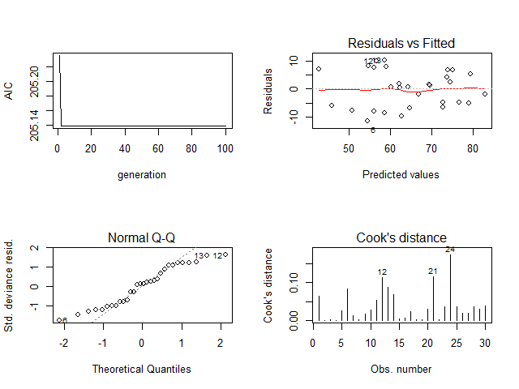

## gaglm packages
Automatic selection of explanatory variable of multiple regression analysis by genetic algorithm.

### Description
It is generally difficult to select explanatory variables in multiple regression analysis. This package automatically selects explanatory variables of multiple regression analysis with genetic algorithm and it will be useful for creating your statistical model.

### Installation
You can install from R console.

If `devtools` is not installed on your PC, install `devtools` with Internet connection.

    install.packages("devtools")

Install from GitHub using `devtools`.
    
    library(devtools)
    install_github("ToshihiroIguchi/gaglm")

Load the `gaglm` package and attach it.

    library(gaglm)

Installation may fail if running under proxy environment.
In that case, you may be able to install using the `httr` package.

### Examples
We explain the usage of `gaglm` function specifically using `attitude`.
Like the `glm` function, write an expression in `formula` form and specify data.frame for `data`.
The objective variable is  `rating ` and the explanatory variable is all other items.

    result <- gaglm(rating ~ complaints + privileges + learning + raises + critical + advance, data = attitude)

By using the plot function, it shows the selection of variables by genetic algorithm, the transition of information quantity criteria, and the result of regression diagnosis.

    plot(result)
    


An optimal explanatory variable by genetic algorithm was found in a short time.
There is no problem with the result of regression diagnosis.
    
In addition, by using the summary function, we can confirm the result with the smallest information criterion.
    
    summary(result)

If variable selection does not work, it may be solved by changing the value of `zeroToOneRatio` of `gaglm` function.    


### References
Dobson, A. J. (1990) An Introduction to Generalized Linear Models. London: Chapman and Hall.

Hastie, T. J. and Pregibon, D. (1992) Generalized linear models. Chapter 6 of Statistical Models in S eds J. M. Chambers and T. J. Hastie, Wadsworth & Brooks/Cole.

McCullagh P. and Nelder, J. A. (1989) Generalized Linear Models. London: Chapman and Hall.

Venables, W. N. and Ripley, B. D. (2002) Modern Applied Statistics with S. New York: Springer.

C.B. Lucasius and G. Kateman (1993). Understanding and using genetic algorithms - Part 1. Concepts, properties and context. Chemometrics and Intelligent Laboratory Systems 19:1-33.

C.B. Lucasius and G. Kateman (1994). Understanding and using genetic algorithms - Part 2. Representation, configuration and hybridization. Chemometrics and Intelligent Laboratory Systems 25:99-145.

Chatterjee, S. and Price, B. (1977) Regression Analysis by Example. New York: Wiley. (Section 3.7, p.68ff of 2nd ed.(1991).)

### License 

```
MIT License

Copyright (c) 2017 Toshihiro Iguchi

Permission is hereby granted, free of charge, to any person obtaining a copy
of this software and associated documentation files (the "Software"), to deal
in the Software without restriction, including without limitation the rights
to use, copy, modify, merge, publish, distribute, sublicense, and/or sell
copies of the Software, and to permit persons to whom the Software is
furnished to do so, subject to the following conditions:

The above copyright notice and this permission notice shall be included in all
copies or substantial portions of the Software.

THE SOFTWARE IS PROVIDED "AS IS", WITHOUT WARRANTY OF ANY KIND, EXPRESS OR
IMPLIED, INCLUDING BUT NOT LIMITED TO THE WARRANTIES OF MERCHANTABILITY,
FITNESS FOR A PARTICULAR PURPOSE AND NONINFRINGEMENT. IN NO EVENT SHALL THE
AUTHORS OR COPYRIGHT HOLDERS BE LIABLE FOR ANY CLAIM, DAMAGES OR OTHER
LIABILITY, WHETHER IN AN ACTION OF CONTRACT, TORT OR OTHERWISE, ARISING FROM,
OUT OF OR IN CONNECTION WITH THE SOFTWARE OR THE USE OR OTHER DEALINGS IN THE
SOFTWARE.
```

### Auther
Toshihiro Iguchi
